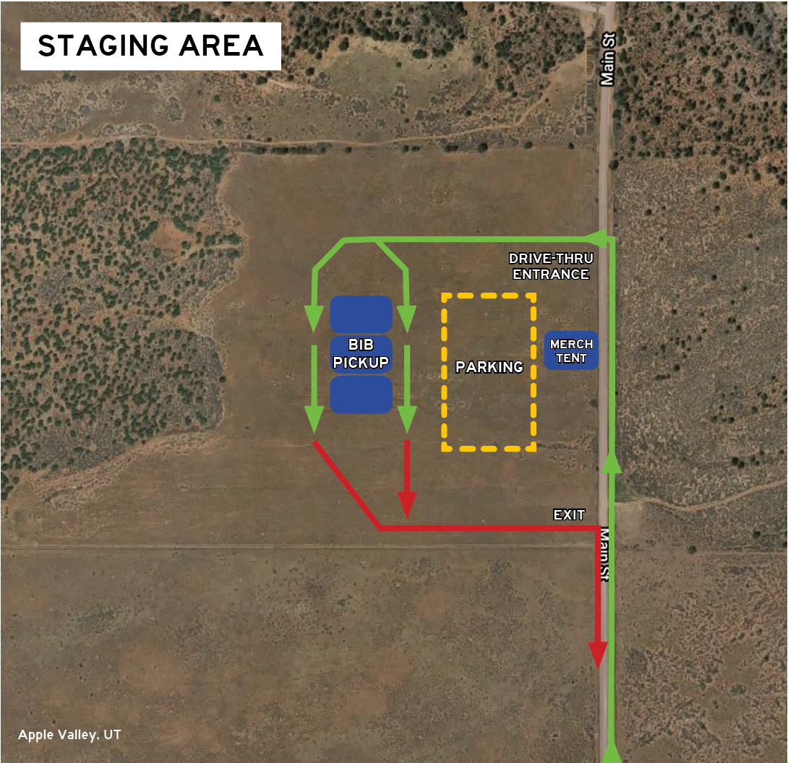

---
---
Zion 100 Mile Race
==================

**Website:** [Zion Ultras](https://vacationraces.com/ultras/zion)

**Date:** April 10-11, 2021

**Start Times:**
* 5:00-5:30AM (100 Miler)
* 6:00-6:30AM (100K)
* 7:00-7:30AM (50K)
* 8:00-8:30AM (Half Marathon)

**Race Location:** [Ruby Rider Ranch](https://bit.ly/rrr-map)

**Hotel Info:** 
* Website: [Hotel Zion Inn](https://hotelzioninn.com)
* Address: [150 N State St, La Verkin, UT 84745](https://g.page/HotelZionInn?share)
* Confirmation numbers:
  - 362127406 (April 8-12)

**Bib Pickup:** 
* Location: [Ruby Rider Ranch](https://bit.ly/rrr-map)
* Date/Time: Friday April 9, Noon-7:00PM

**Drop Bags:**
* Deadline: Friday (4/9) 8:00PM
* Name, Bib#, aid station, and race distance
* Min size: gallon size zip lock

**Pacers & Crew Directions:**
* [Virgin Desert Aid Station (Mile 25.8)](https://goo.gl/maps/p5rxFZBoznb8urrRA)
* [Virgin BMX Aid Station (Miles 51.8 and 70)](https://goo.gl/maps/fnpPxPqkrCe2ybTZ8)
* [Crew Acess Point (Mile 80.1)](https://goo.gl/maps/4kyo1vqHFaVM8Qwy9)

**Miscellaneous Info:**
* [Facebook course video]( https://www.facebook.com/watch/live/?v=758444185083165&ref=watch_permalink)
* [Map of area](https://www.trailforks.com/trails/map/?lat=37.12523&lon=-113.13548&z=12.2&activitytype=1)

**Course Info:**

<iframe src='https://www.hellodrifter.com/embedded/v1/dlvbdd' width="500" height="300"></iframe>

_Note: go to [hellodrifter](https://www.hellodrifter.com/routes/2021-zion-100-mile-by-ak#) for full size map_

* [GPX Download](2021-zion-100M.gpx)
* [Course Profile](2021-zion-100M-profile.png)
* [Course Map](2021-zion-100M-map.png)